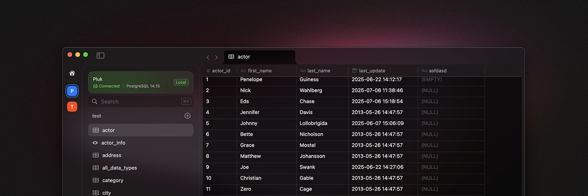
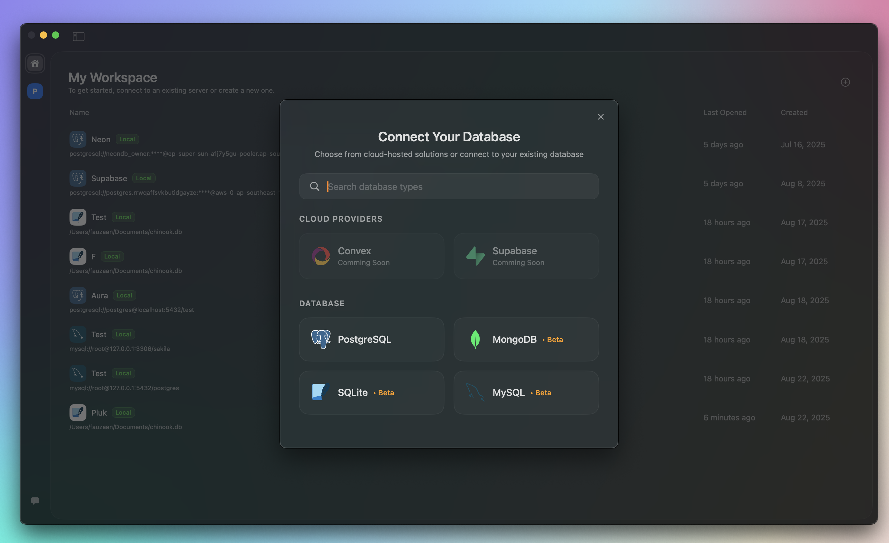
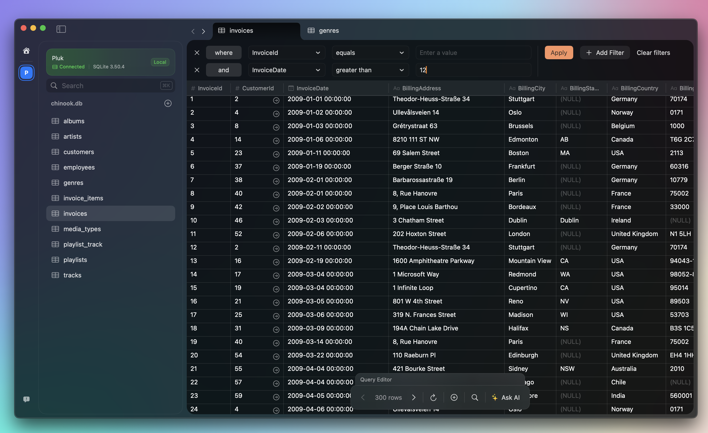
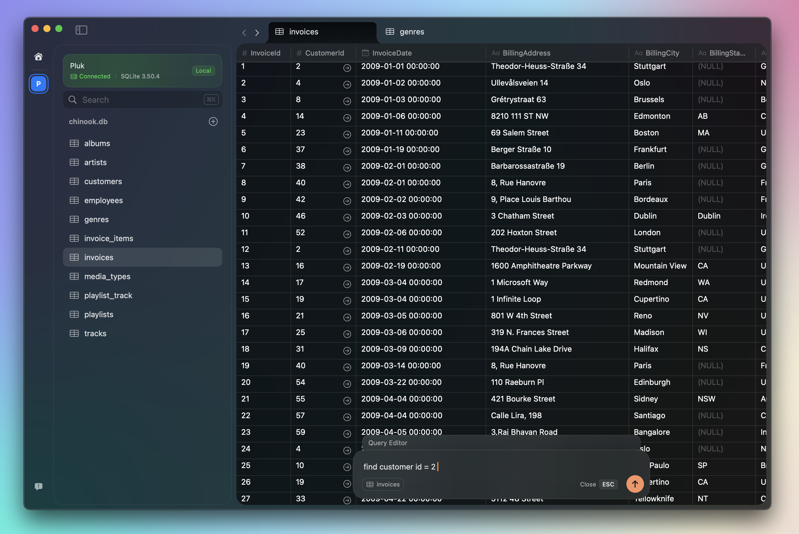

  
  
  # Pluk
  
  **Native macOS database client for MongoDB, Postgres, MySQL, & SQLite**  
  *AI does the querying, you explore your data* ✨
  
  
  
  
  
  

---

## 🚀 About Pluk

Pluk is a powerful, native macOS database client that revolutionizes how you interact with your databases. With AI-powered querying capabilities, Pluk makes database exploration intuitive and efficient for developers, data analysts, and database administrators.

### ✨ Key Features

- **🤖 AI-Powered Querying** - Natural language to SQL/NoSQL conversion
- **🔗 Multi-Database Support** - MongoDB, PostgreSQL, MySQL, SQLite
- **🎨 Native macOS Design** - Beautiful, responsive interface built for Mac
- **⚡ Lightning Fast** - Optimized performance for large datasets
- **🔒 Secure Connections** - SSL/TLS support with credential management
- **📊 Data Visualization** - Built-in charts and graphs *(coming soon)*
- **💾 Query History** - Save and organize your favorite queries *(coming soon)*
- **🔄 Real-time Updates** - Live data refresh capabilities *(coming soon)*
- **🔌 Cloud Integrations** - Supabase, Convex, Neon support *(coming soon)*

## 📸 Screenshots

  
    

  
    
  
  

## 🔧 Supported Databases

| Database | Version | Features |
|----------|---------|----------|
| **MongoDB** | 3.6+ | Collections |
| **PostgreSQL** | 9.6+ | Full SQL, JSON |
| **MySQL** | 5.7+ | Full SQL |
| **SQLite** | 3.8+ | Local files |

## 📋 Issue Tracking

This repository is dedicated to tracking bugs, feature requests, and feedback for Pluk. We welcome your contributions to make Pluk even better!

### 🐛 Reporting Bugs

Before submitting a bug report, please:

1. **Search existing issues** to avoid duplicates
<!-- 2. **Check our [FAQ](https://www.pluk.sh/faq)** for common solutions -->
2. **Provide detailed information** using our bug report template

[**🐛 Report a Bug**](https://github.com/pluk-inc/pluk/issues/new?template=bug_report.md)

### 💡 Feature Requests

Have an idea to improve Pluk? We'd love to hear it!

[**💡 Request a Feature**](https://github.com/pluk-inc/pluk/issues/new?template=feature_request.md)

### 📝 Issue Templates

- [🐛 Bug Report](/.github/ISSUE_TEMPLATE/bug_report.md)
- [💡 Feature Request](/.github/ISSUE_TEMPLATE/feature_request.md)
- [📚 Documentation](/.github/ISSUE_TEMPLATE/documentation.md)
- [❓ Question](/.github/ISSUE_TEMPLATE/question.md)

## 🏷️ Labels

We use labels to categorize and prioritize issues:

| Label | Description |
|-------|-------------|
| `bug` | Something isn't working |
| `enhancement` | New feature or request |
| `documentation` | Improvements to documentation |
| `good first issue` | Good for newcomers |
| `help wanted` | Extra attention is needed |
| `priority: high` | High priority issues |
| `status: in progress` | Currently being worked on |

## 📊 Project Status

- **Status**: Waitlist (Beta)
- **Platform**: macOS 15.0
- **Architecture**: Apple Silicon & Intel
- **Development**: Active

## 🔗 Quick Links

- 🌐 **Website**: [pluk.sh](https://www.pluk.sh/)
- 📝 **Join Waitlist**: [pluk.sh](https://www.pluk.sh)
- 🐦 **Twitter**: [@PlukApp](https://twitter.com/PlukApp)

## 🤝 Contributing

While this repository is primarily for issue tracking, we welcome:

- **Bug reports** with detailed reproduction steps
- **Feature suggestions** with clear use cases
- **Documentation improvements**
- **Community feedback** and discussions

---

  
Made with ❤️ for the developer community

  

    <a href="https://www.pluk.sh/">Website</a> •
    <a href="https://github.com/pluk-inc/pluk/issues">Issues</a>
  

